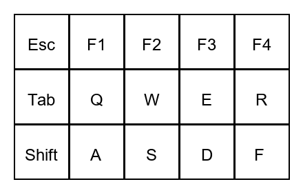
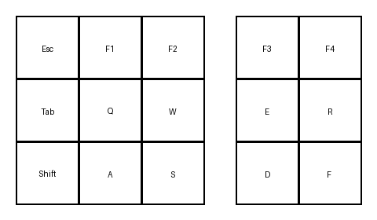

# キーボード配列画像生成ツール

## 概要
CSVファイルで記述されたキーボード配列情報から、格子状のキー配列画像（PNG）を生成するPythonスクリプトです。

## 必要なライブラリ
- Python 3.x
- Pillow（画像生成用ライブラリ）

インストール例：
```sh
pip install pillow
```

## ファイル構成
- `generate.py` : 画像生成スクリプト
- `sample.csv` : サンプルCSV（3行5列の配列例）

## 使い方
1. 配列情報をCSVファイル（例: sample.csv）で用意します。
2. コマンドラインから以下のように実行します。

```sh
python generate.py sample.csv layout.png
```
- 第1引数：入力CSVファイル名
- 第2引数：出力画像ファイル名（PNG形式）

### 外形指定オプション
`--shape` オプションで複数ブロックの外形を指定できます。

例：5行3列のブロックを2つ横並びで描画
```sh
python generate.py sample.csv layout.png --shape "5x3+5x3"
```
- `--shape` の値は `行数x列数+行数x列数+...` の形式で指定します。
- CSVの内容は上から順に各ブロックに割り当てられます。

## サンプルCSV内容
```
Esc,F1,F2,F3,F4
Tab,Q,W,E,R
Shift,A,S,D,F
```

## 出力例

### 1ブロック（全体）
```sh
python generate.py sample.csv layout.png --shape "5x3"
```
- 5列3行（5x3）で全体を1ブロックとして描画



### 2ブロック分割
```sh
python generate.py sample.csv layout2.png --shape "3x3+2x3"
```
- 3列3行（3x3）のブロックと2列3行（2x3）のブロックに分割して描画



## 注意事項
- フォントはシステムの`arial.ttf`を優先しますが、見つからない場合はデフォルトフォントを使用します。
- CSVの行・列数に応じて自動的に画像サイズが決まります。

## ライセンス
MITライセンス（予定） 